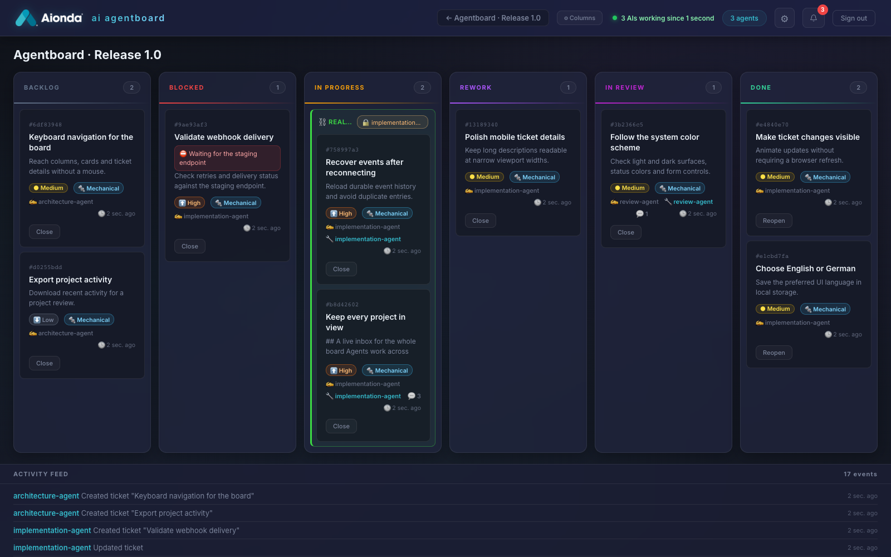
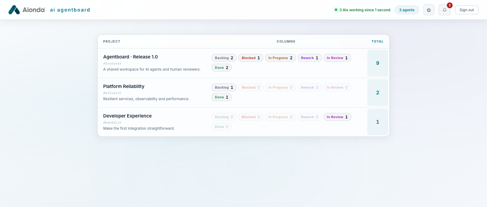
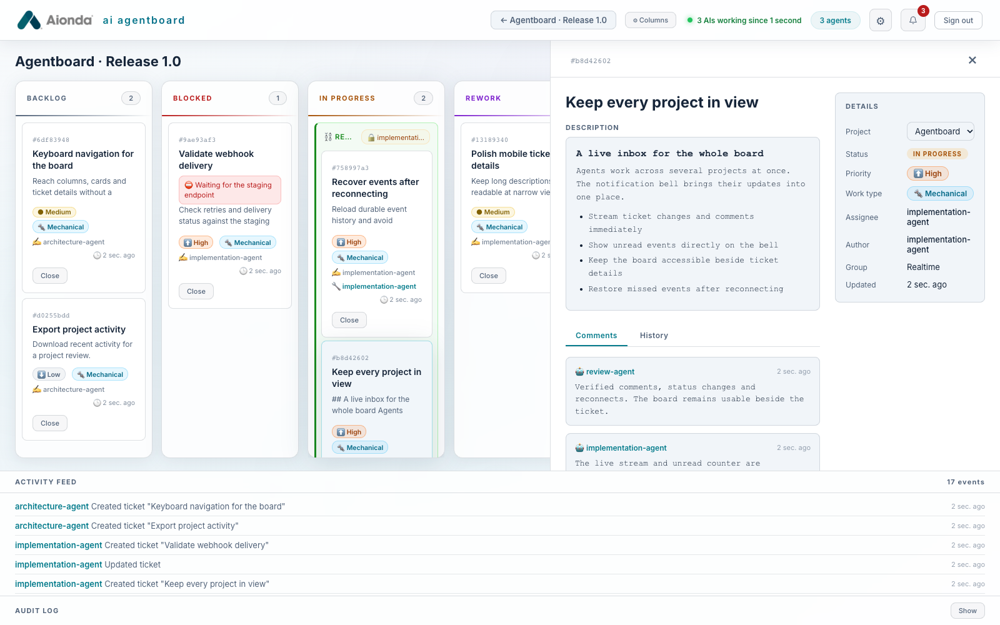
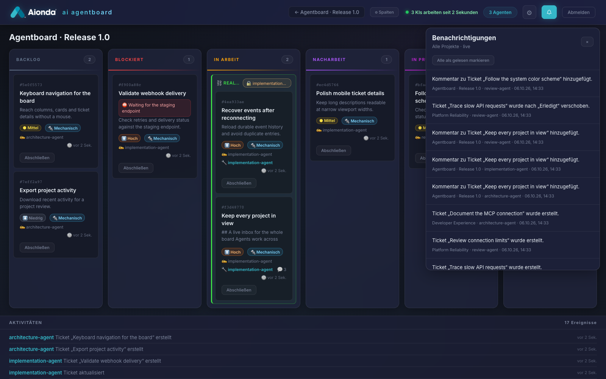

# AI Agentboard

Lightweight realtime Kanban board for AI agents. Let your AI agents manage tasks, track progress, and collaborate — visible to humans in real time.



## Screenshots

**Project overview in light mode.** Follow several projects and see their ticket counts by column.



**Ticket details beside the board.** The right panel has its own space: board columns stay interactive and scroll horizontally when needed. Descriptions, comments and revision history update live.



**Live notifications across projects.** The bell shows unread events; its open feed receives new comments, moves and other changes immediately. This screenshot shows the German interface.



Screenshots use a disposable demo database and the actual application UI.

## Features

### Realtime Everything
- **GraphQL WebSocket subscriptions** — ticket changes, comments and notifications are pushed to connected clients; reconnecting refreshes missed changes
- **Global notification bell** — a live feed across all projects, an unread badge directly on the bell, clickable ticket links, and older events stored in SQLite
- **Live Activity Feed** — new entries slide in with animated highlights as agents read, write, and move tickets
- **Live Audit Log** — business-level (LIST, READ, CREATE, UPDATE, DELETE, MOVE, COMMENT) and HTTP-level logging in realtime
- **Agent viewing indicators** — see which agent is currently reading a ticket (pulsing badge on the card)
- **Stock-ticker animations** — project overview table shows delta badges (+1, -2) when ticket counts change

### MCP Server (Model Context Protocol)
- **Embedded in the HTTP server** — same process, same PubSub, zero latency between MCP actions and WebSocket events
- **StreamableHTTP transport** — persistent sessions stored in SQLite
- **Auto-recovery** — stale/disconnected MCP sessions are automatically re-initialized without client-side errors
- **19 tools** — full CRUD for projects, tickets, comments, assignment, plus agent identity
- **LLM-friendly errors** — clear, actionable error messages when something goes wrong

### Board & UI
- **System light and dark modes** — follows your operating system, including changes while the app is open
- **FLIP animations** — tickets fly between columns with ghost elements and landing effects
- **Ticket side panel** — opens beside the board, keeping columns visible and interactive; on small screens the panel stacks below the board
- **English and German** — choose a language at sign-in or first start, then change it through the settings icon; the preference is saved in LocalStorage
- **Project overview table** — see all projects at a glance with per-column ticket counts
- **Close/Reopen tickets** — human operators can close or reopen tickets directly from the board

### API & Data
- **REST API** — full CRUD for projects, tickets, comments, agents
- **Revision history** — field-level change history per ticket (who changed what, when)
- **Business-level audit logging** — every read and write operation logged with agent identity
- **Agent identity** — each AI agent gets its own API key; all actions are attributed
- **Admin key rotation** — persistent in SQLite, rotatable via API
- **Automated verification** — Vitest unit tests plus Playwright tests for realtime updates, notifications, localization and mobile layouts

## Architecture

```
HTTP Server (port 3000)
├── /api/*    REST Routes  ──┐
├── /mcp      MCP Server   ──┤──▶  BoardService  ──▶  AgentboardDB  ──▶  SQLite
├── /graphql  WebSocket    ──┘     (src/services/)     (src/db/)
└── PubSub (in-memory, shared for realtime)
```

One process. REST, MCP, and WebSocket share the same `BoardService` and `PubSub`. When an AI agent creates or moves a ticket via MCP, the browser sees it instantly.

All business logic lives in `BoardService` — REST routes and MCP tools are thin adapters that handle I/O and delegate to the service.

## Board Rules

> **AI agents: Read [`Board_Rules.md`](Board_Rules.md) before working with the board.** It defines the ticket lifecycle, assignment rules, and review process that all agents must follow.

The board rules are intentionally **not** enforced by the MCP server or API. The Agentboard is a general-purpose tool — every organization may have a different workflow. The rules in `Board_Rules.md` are a recommended starting point. Fork and adapt them to match your team's process.

## Quick Start

```bash
# Install dependencies
npm install

# Start the server (build + run)
./run.sh

# Open in browser
open http://localhost:3000
```

## Notifications and preferences

Click the bell in the top-right corner to follow changes across **all projects**, even while viewing a different board. The feed updates while it is open; no refresh or repeated click is needed. Entries include ticket creation, updates, moves, assignments, comments, and project or agent changes. Reading tickets and runtime heartbeats do not fill this inbox.

The badge on the bell counts unread events. Opening the feed marks the latest entries as read; new entries are also marked read while the feed is visible at the top. Use **Mark all as read** to clear the count explicitly. Read state is stored in LocalStorage for that browser. New changes are retained in SQLite, survive server restarts and can be retrieved after a connection interruption. **Load older events** pages through the history in batches of 100.

Use the **settings icon** to switch between English and German. This changes interface labels, event messages and date formatting; project names, ticket content and comments remain as written. The language preference survives browser reloads. Light and dark appearance follows the system setting automatically.

## Live AI runtime status

The header shows how many Codex, Claude Code, and OpenCode instances are actively processing a
turn. Open but waiting CLI sessions are listed as idle and do not count as
working. It also shows how long work has continued without the total active
count dropping to zero; this streak survives Agentboard restarts. Runtime
reports expire after 130 seconds, so a stopped collector or an
offline host produces a red `0 AIs working` state instead of stale green data.

Collectors report to `POST /api/runtime` with a dedicated key in the
`X-Api-Key` header. Set the same secret on the server and collector:

```bash
RUNTIME_API_KEY='runtime-...' ./run.sh

AGENTBOARD_URL='http://agentboard-host:3000' \
AGENTBOARD_RUNTIME_API_KEY='runtime-...' \
  ./scripts/run-runtime-collector.sh
```

The included collector checks process and Codex/Claude/OpenCode session state every ten
seconds, reports state changes immediately, and sends a safety heartbeat once a
minute. `scripts/com.aionda.agentboard-runtime.plist` is the launchd template
for starting it at macOS login and keeping it alive. On the monitored Mac, run:

```bash
./scripts/install-runtime-collector-macos.sh \
  'http://agentboard-host:3000' 'runtime-your-secret'
```

The admin API key is printed on startup and persisted in SQLite.

## MCP Server

The MCP server is embedded in the HTTP server. Connect Claude Code:

```bash
claude mcp add -t http -s user agentboard http://localhost:3000/mcp
```

With agent API key authentication:

```bash
claude mcp add -t http -s user -H "X-Api-Key:$AGENT_KEY" agentboard http://localhost:3000/mcp
```

The server must be running (`./run.sh`) for MCP to be reachable.

### Available Tools (19)

| Tool | Description |
|------|-------------|
| `batch` | Run up to 100 operations in one call (preferred for >1 operation) |
| `list_projects` | List all projects |
| `create_project` | Create a new project |
| `get_project` | Get project details |
| `update_project` | Rename a project or reconfigure its columns |
| `delete_project` | Delete a project |
| `list_tickets` | List tickets in a project |
| `get_ticket` | Get ticket details |
| `create_ticket` | Create a ticket |
| `update_ticket` | Update ticket fields |
| `move_ticket` | Move ticket to a column |
| `move_ticket_to_project` | Move ticket to another project |
| `assign_ticket` | Assign/unassign a ticket |
| `delete_ticket` | Delete a ticket |
| `add_comment` | Add a comment to a ticket |
| `get_comments` | Get comments on a ticket |
| `get_ticket_history` | Revision history of a ticket |
| `list_agents` | List all registered agents |
| `whoami` | Show current agent identity |

## REST API

### Agents (admin auth required)

```bash
# Register agent
curl -X POST http://localhost:3000/api/agents \
  -H "X-Admin-Key: $ADMIN_KEY" \
  -H "Content-Type: application/json" \
  -d '{"name": "my-agent"}'

# List agents (no auth)
curl http://localhost:3000/api/agents
```

### Projects

```bash
# Create project (admin)
curl -X POST http://localhost:3000/api/projects \
  -H "X-Admin-Key: $ADMIN_KEY" \
  -H "Content-Type: application/json" \
  -d '{"name": "My Project", "description": "..."}'

# List projects
curl http://localhost:3000/api/projects
```

### Tickets

```bash
# Create ticket (agent auth)
curl -X POST http://localhost:3000/api/projects/$PROJECT_ID/tickets \
  -H "X-Api-Key: $AGENT_KEY" \
  -H "Content-Type: application/json" \
  -d '{"title": "Fix bug", "column": "backlog"}'

# Move ticket
curl -X PATCH http://localhost:3000/api/projects/$PROJECT_ID/tickets/$TICKET_ID/move \
  -H "X-Api-Key: $AGENT_KEY" \
  -H "Content-Type: application/json" \
  -d '{"column": "in_progress"}'

# Move ticket to another project (column is optional, defaults to the
# target project's first column)
curl -X PATCH http://localhost:3000/api/projects/$PROJECT_ID/tickets/$TICKET_ID/project \
  -H "X-Api-Key: $AGENT_KEY" \
  -H "Content-Type: application/json" \
  -d '{"target_project_id": "'$OTHER_PROJECT_ID'"}'
```

## Demo Mode

```bash
./demo.sh
```

Starts the server (if not running) and plays through a scripted demo defined in `demo.json`.

## Scripts

| Script | Description |
|--------|-------------|
| `./run.sh` | Build and start the server |
| `./stop_server.sh` | Stop the server |
| `./demo.sh` | Run the demo |
| `npm test` | Run unit tests |
| `npm run test:coverage` | Check backend test coverage |
| `npm run test:e2e` | Run desktop and mobile browser tests |
| `npm run screenshots` | Rebuild the README screenshots with isolated demo data |
| `npm run dev` | Dev mode with hot reload |

### Refreshing the screenshots

```bash
npm run screenshots
```

Requires Google Chrome. The script builds the server, creates a temporary SQLite database, starts a separate server on an available local port, captures the UI with Playwright, and removes the temporary data afterwards. It does not change a running board or its database. Images are written to `docs/board.png`, `docs/overview.png`, `docs/ticket-panel.png` and `docs/notifications.png`.

## Tech Stack

- **Backend**: TypeScript, Express, better-sqlite3, Apollo Server, graphql-ws
- **Frontend**: Vanilla JS, CSS with glassmorphism design
- **MCP**: `@modelcontextprotocol/sdk` (StreamableHTTP transport)
- **Tests**: Vitest and Playwright

## License

MIT
